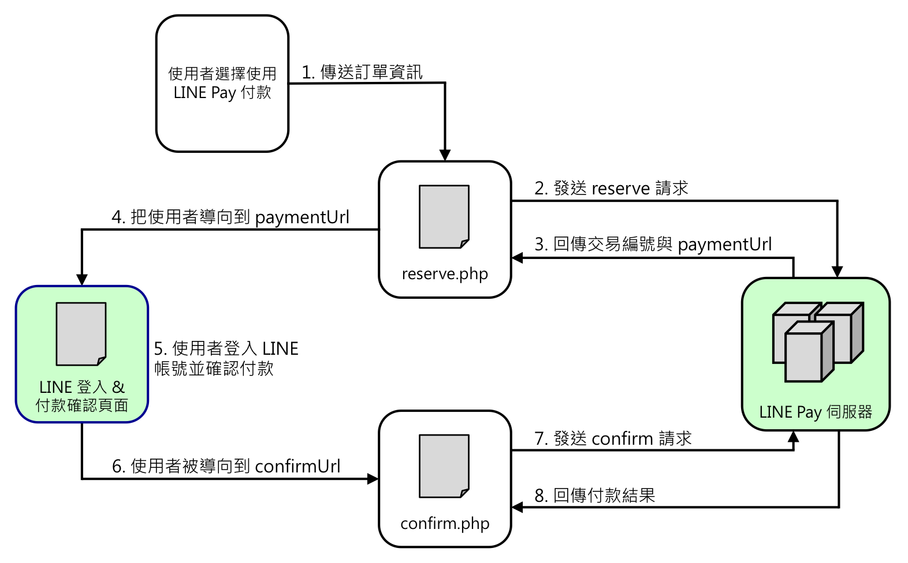
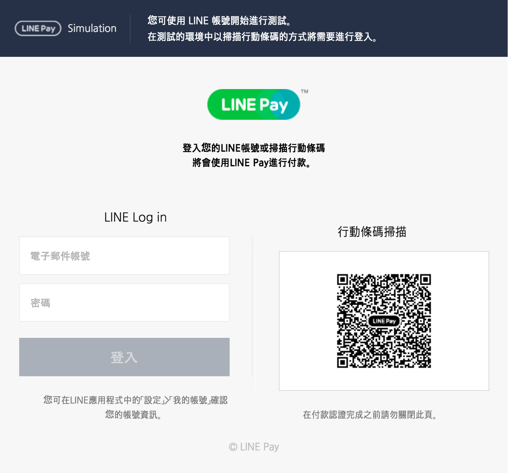
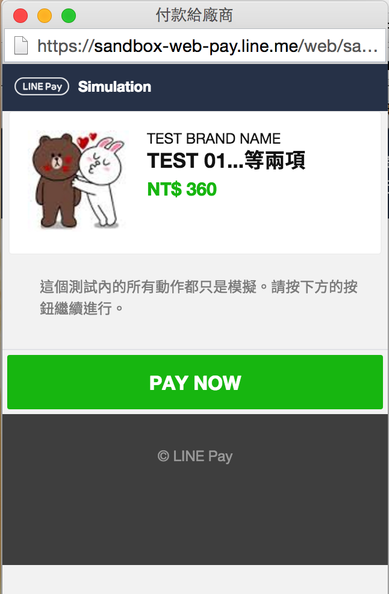

# LINE Pay 一般付款的教學與範例
此教學以在 Sandbox 進行一般付款（付款授權與請款同時進行）為範例  

## 目錄
* [LINE Pay 付款流程說明](#line-pay-付款流程說明)
  * [角色](#角色)
  * [流程](#流程)
* [付款功能開發範例](#付款功能開發範例)
  * [購物網站的付款流程與頁面](#購物網站的付款流程與頁面)
  * [步驟](#步驟)

## LINE Pay 付款流程說明：
以下流程是以**電腦版網頁介面**來進行**付款授權與請款同時進行**的一般付款為例：
> LINE Pay 的一般付款包含兩種：「同時進行」付款授權與請款，或「分開進行」

#### 角色
在一次的付款的流程中，可以想像有三種角色參與其中：
* 商家的購物網站
* 網站使用者（買家）
* LINE Pay 伺服器  

#### 流程
1. 使用者在購物網站上選擇使用 LINE Pay 付款
2. 購物網站發送 Reserve 請求給 LINE Pay 伺服器，參數包含訂單的名稱、金額、確認付款頁面的位置(`confirmUrl`)等
3. LINE Pay 伺服器成功收到 Reserve 請求後，會回傳交易編號與付款頁面的位址(`paymentUrl`)給購物網站
4. 購物網站把使用者導向到`paymentUrl`
5. 使用者登入 LINE 帳號進行付款
6. 付款完成後，LINE 會把使用者導回至購物網站的確認付款頁面（即第 2 步驟內的`confirmUrl`）  
7. 購物網站發送 Confirm 請求給 LINE Pay 伺服器，向 LINE Pay 確認使用者是否已經進行付款  
8. LINE Pay 伺服器回傳付款結果
  
## 付款功能開發範例
* PHP 版本: v5.5.9
* LINE Pay API 版本: v2
* [Sandbox 測試工具原始碼（PHP 網頁介面）](../Example)
* [PHP Libary (Chinwei6/LinePay) for LINE Pay API](../Chinwei6_LinePay.php) (使用 php_curl 實作)

#### 購物網站的付款流程與頁面
依照上面的 LINE Pay 付款流程，我們可以把購物網站的 LINE Pay 付款功能流程設計為：  


此流程中包含兩個 PHP 頁面：  
`reserve.php`: 把訂單資訊發送給 LINE Pay 伺服器的頁面  
`confirm.php`: 使用者在 LINE Pay 付款完成後，被重新導向至購物網站的頁面，同時也會向 LINE Pay 伺服器確認付款結果


#### 步驟
1. 在購物網站的付款頁面放上「使用 LINE Pay 付款」的按鈕，買家點擊此按鈕後，購物網站會透過 `reserve.php` 發送訂單資訊給 LINE Pay 伺服器。

  > *按鈕樣式可參考官方[LOGO 使用指南](https://pay.line.me/tw/intro/logoUsageGuide)  
  > *`reserve.php` 的功能其實只是要發送請求，可以不用 UI 畫面。

2. 在 `reserve.php` 使用 LINE Pay Reserve API，將訂單的資訊作為參數發送 POST 請求給 LINE Pay 伺服器，Reserve API 的參數須包含訂單的名稱、金額、確認付款頁面的位置(`confirmUrl`)等。Reserve API 的規格與必要參數如下：

  #### Reserve API 規格  

  項目 | 說明
  ---- | --- 
  Method | POST
  Required Request Header | `Content-Type:application/json; charset=UTF-8`<br>`X-LINE-ChannelId:{{channelId}}`<br>`X-LINE-ChannelSecret:{{channelSecretKey}}`
  Sandbox 環境 API 地址 | https://sandbox-api-pay.line.me/v2/payments/request
  Real 環境 API 地址 | https://api-pay.line.me/v2/payments/request

    
  #### Reserve API 請求的必要參數  

  名稱 | 資料型別 | 說明
  ---- | ------- | ---
  productName | String | 訂單名稱，例如：`商品XXX..等三項`
  productImageUrl | String | 商品圖片 URL，顯示於付款畫面上的影像
  amount | Number | 付款金額
  currency | String | 付款貨幣 (ISO 4217)，例如 `TWD`、`JPY`、`USD`
  confirmUrl | String | 買家在 LINE Pay 選擇付款方式並輸入密碼後，被重新導向到商家的 URL
  orderId | String | 商家與該筆付款請求對應的訂單編號（這是商家自行管理的唯一編號）

  > 還有其他的非必要參數請參考官方[LINE Pay 技術連動指南](https://pay.line.me/tw/intro/techSupport)

  #### reserve.php 程式碼範例  

  ``` php
  <?php 
  /* reserve.php */

  // 引用 Chinwei6/LinePay PHP Libary
  require_once("Chinwei6_LinePay.php");

  $apiEndpoint   = "...";  // API 位置
  $channelId     = "...";  // 通路ID
  $channelSecret = "...";  // 通路密鑰

  // 建立 Chinwei6\LinePay 物件
  $LinePay = new Chinwei6\LinePay($apiEndpoint, $channelId, $channelSecret);

  // 建立訂單資訊作為 POST 的參數
  $params = [
      "productName"     => "...",
      "productImageUrl" => "...",
      "amount"          => "...",
      "currency"        => "...",
      "confirmUrl"      => "...",
      "orderId"         => "...",
      "confirmUrlType"  => "...",
  ];

  // 發送 reserve 請求，reserve() 回傳的結果為 Associative Array 格式
  $result = $LinePay->reserve($params);

  if($result['returnCode'] == '0000') {
    // Reserve 請求成功!
    $paymentUrl = $result['info']['paymentUrl']['web'];
  }
  ```
3. 若請求成功，LINE Pay 伺服器會回傳：

  #### Reserve API 回應 (JSON 格式)

  ```
  {
    "returnCode": "0000",          // 結果代碼，例如 `0000` 表示成功
    "returnMessage": "success",    // 結果訊息或失敗理由，例如 `商家驗證資訊錯誤`
    "info": {
      "paymentUrl": {             
        "web": "...",              // 付款請求後所前往的網頁 URL (LINE Pay 等待付款畫面的 URL)
        "app": "..."               // 前往付款畫面的應用程式 URL
      },
      "transactionId": ...,        // 交易編號 (19 位數)
      "paymentAccessToken": "..."  // 在 LINE Pay app 輸入的代碼（在本範例未使用到）
    }
  }
  ```

4. 在 `reserve.php` 收到請求成功的回應後，就可以把使用者導向到 `paymentUrl` 的頁面（電腦版請使用 `info.paymentUrl.web` 的 URL），此頁面為 LINE 提供的登入與付款頁面，如圖：
  

5. 使用者在此頁面登入 LINE 帳號後，會出現 LINE Pay 的彈出視窗（如下圖），確認商品名稱與金額無誤後，點擊 PAY NOW 即可進行付款。
  > 如果瀏覽器有封鎖此頁面的彈出視窗，可先解除對此 LINE Pay 網域的封鎖  

  

6. 付款完成後，剛剛開啟 `paymentUrl` 的頁面會被導向至 `confirmUrl`，`confirmUrl` 就是在第 2 步發出 Reserve 請求時所傳遞給 LINE Pay 伺服器的參數之一。在本範例中，也就是把使用者導回至購物網站的 `confirm.php` 頁面。

7. 在 `confirm.php` 使用 LINE Pay Confirm API，發送 POST 請求給 LINE Pay 伺服器，向 LINE Pay 確認使用者是否已經完成付款。Confirm API 的規格與必要參數如下：
  
  #### Confirm API 規格  

  項目 | 說明
  ---- | --- 
  Method | POST
  Required Request Header | `Content-Type:application/json; charset=UTF-8`<br>`X-LINE-ChannelId:{{channelId}}`<br>`X-LINE-ChannelSecret:{{channelSecretKey}}`
  Sandbox 環境 API 地址 | https://sandbox-api-pay.line.me/v2/payments/{{transactionId}}/confirm
  Real 環境 API 地址 | https://api-pay.line.me/v2/payments/{{transactionId}}/confirm

  #### Confirm API 請求的必要參數  

  名稱 | 資料型別 | 說明
  ---- | ------- | ---
  amount | Number | 付款金額
  currency | String | 付款貨幣 (ISO 4217)，例如 `TWD`、`JPY`、`USD`

  #### confirm.php 程式碼範例  

  ``` php
  <?php 
  /* confirm.php */

  // 引用 Chinwei6/LinePay PHP Libary
  require_once("Chinwei6_LinePay.php");

  $apiEndpoint   = "...";  // API 位置
  $channelId     = "...";  // 通路ID
  $channelSecret = "...";  // 通路密鑰

  // 建立 Chinwei6\LinePay 物件
  $LinePay = new Chinwei6\LinePay($apiEndpoint, $channelId, $channelSecret);

  // 建立 confirm API 所需要的參數
  $params = [
      "amount"   => "...",
      "currency" => "...",
  ];

  // transactionId 來自之前 Reserve API 請求的回應
  $transactionId = "...";

  // 發送 confirm 請求，confirm() 回傳的結果為 Associative Array 格式
  $result = $LinePay->confirm($transactionId, $params);

  if($result['returnCode'] == '0000') {
    // Confirm 請求成功!
  }
  ```
  
8. 若請求成功，表示使用者確實已經透過 LINE Pay 進行付款，LINE Pay 伺服器會回傳：

  #### Confirm API 回應 (JSON 格式)

  ```
  {
    "returnCode": "0000",        // 結果代碼，例如 `0000` 表示成功
    "returnMessage": "success",  // 結果訊息或失敗理由，例如 `商家驗證資訊錯誤`
    "info": {
      "transactionId": ...,      // 付款 reserve 後,做為結果所收到的交易編號
      "orderId": "...",          // 商家在付款reserve 時傳送的訂單編號
      "payInfo": [
        {
          "method": "...",       // 使用的付款方式 (信用卡: CREDIT_CARD、餘額: BALANCE,折扣: DISCOUNT)
          "amount": ...          // 付款金額
        }
      ]
    }
  }
  ```

## 若是付款授權與請款「分開」進行
如果商家有提供給買家鑑賞期的需求，希望將付款授權與請款兩者分別處理的話，只須在購物網站發送 Reserve 請求時，將參數 `capture` 設定為 `false`(表示不要立即請款)，原本的 Confirm 請求就會變成是「付款授權」而已，而實際付款必須再由購物網站發送額外的 Capture 請求才會完成。

#### Capture API 規格  

項目 | 說明
---- | --- 
Method | POST
Required Request Header | `Content-Type:application/json; charset=UTF-8`<br>`X-LINE-ChannelId:{{channelId}}`<br>`X-LINE-ChannelSecret:{{channelSecretKey}}`
Sandbox 環境 API 地址 | https://sandbox-api-pay.line.me/v2/payments/authorizations/{{transactionId}}/capture
Real 環境 API 地址 | https://api-pay.line.me/v2/payments/authorizations/{{transactionId}}/capture

#### Capture API 請求的必要參數  

名稱 | 資料型別 | 說明
---- | ------- | ---
amount | Number | 付款金額
currency | String | 付款貨幣 (ISO 4217)，例如 `TWD`、`JPY`、`USD`

換句話說，若分開付款授權與請款，原本購物網站發送 Confirm 請求時並不會完成訂單的付款，而是將該訂單記錄為「已授權」而已。  

<!-- 故在鑑賞其內可再使用「授權作廢 」請求來取消該筆交易，不必讓使用者先付款再進行退款。 -->

